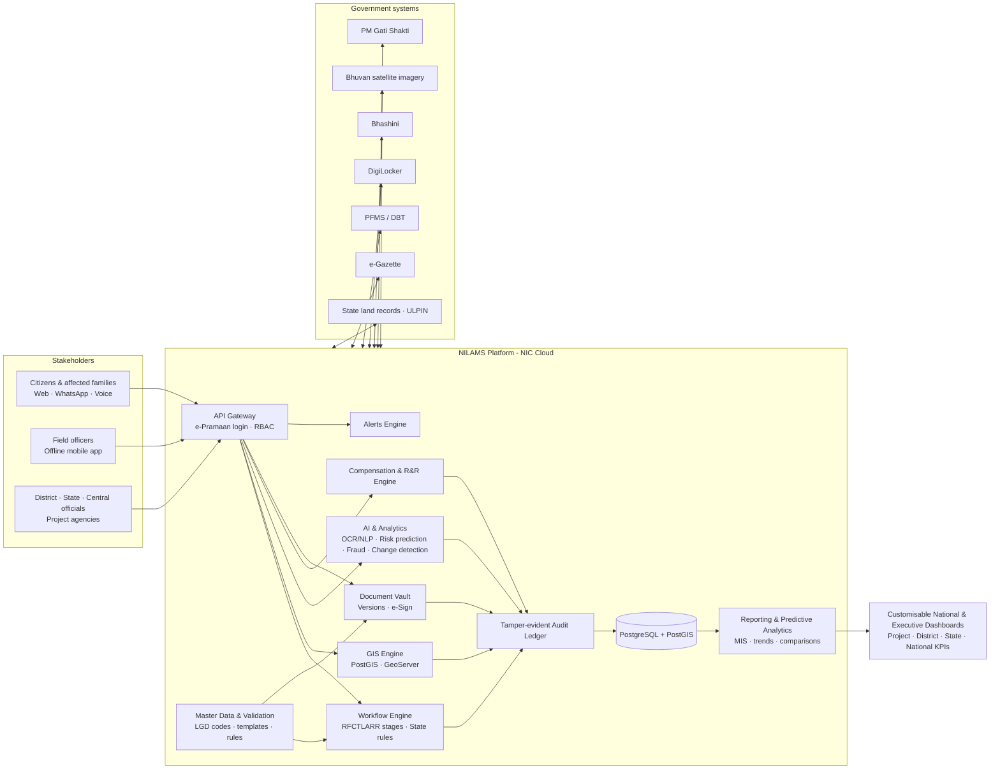
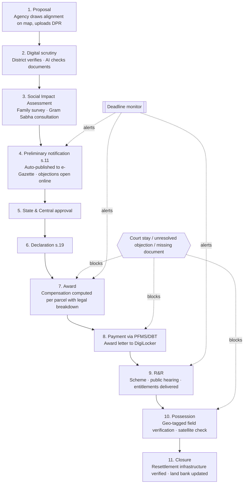
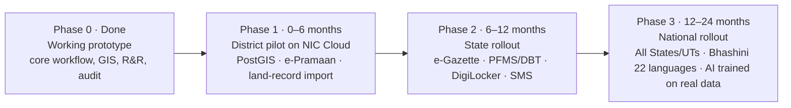

# NILAMS: PPT Content for SIH 2026 Idea Submission (PS 26016)

**Idea title:** NILAMS, the National Integrated Land Acquisition Management System
**Problem Statement ID:** 26016, "Real-Time National Land Acquisition & Management System for End-to-End Digital Monitoring and Decision Support"
**Theme / Sub-theme:** AI, GIS & Data Analytics for Public Administration and Infrastructure Management
**Ministry context:** Department of Land Resources (DoLR), Ministry of Rural Development. Governing law: RFCTLARR Act, 2013

---

## How this content is framed

- **The idea is the hero.** Every slide describes the *proposed national system*: what it will do, for whom, and why it will work across all States and UTs.
- **The prototype is proof, not the pitch.** It appears as short "Already demonstrated in our prototype" callouts, which show judges the idea is buildable and that the team can deliver it.
- **Legend used on slides:** ✅ = working in prototype · 🟡 = partly in prototype · 🔜 = part of the proposed full solution.
- **Complete coverage:** every requirement in `docs/26016.pdf` (description, the 9 real-time parameters, all 12 scope aspects, the expected solution, suggested technology) is mapped in the "PS 26016 complete requirement coverage" tables under Slide 1. This keeps the vision big without over-claiming.
- **For AI/ATS readers:** type all text into real text boxes (never paste text as an image), use the Title placeholder for slide titles, add Alt Text to every image, spell out acronyms once per slide, and put the plain-language explanation in the Notes pane.

---

## SLIDE 1: PROBLEM STATEMENT & PROPOSED SOLUTION

### What is land acquisition? (one line for a first-time reader)
> When the government builds a highway, railway, dam or industrial corridor, it takes private land under the **RFCTLARR Act, 2013**. It must pay fair compensation, resettle affected families, and follow a strict legal sequence of about a dozen stages. Today that journey is tracked on paper and in disconnected systems.

### Current problems (ON-SLIDE TEXT)
1. **No unified national platform:** every state runs its own process. Sector portals (e.g. MoRTH's Bhoomi Rashi for highways) cover only one type of project. The Centre has no single live view.
2. **Manual, inconsistent and duplicated records:** each state collects data in its own format, with no master database or common validation. Land records, notifications and awards are re-typed at district, state and central level, which invites errors and wastes time.
3. **No real-time monitoring:** policymakers cannot instantly see land acquired, compensation paid, possession status or R&R (Rehabilitation and Resettlement) progress.
4. **Delays in approvals and missed statutory deadlines:** files move physically between District, State and Centre with no automated routing. The law sets time limits (e.g. an award within 12 months of the declaration), but nothing warns officials before a deadline lapses.
5. **Opaque compensation:** landowners get a final amount without a breakdown, which leads to mistrust, objections and litigation.
6. **Families are invisible:** systems track land, not people. Tenants, labourers and other non-titleholders who lose livelihoods often go unrecorded.
7. **Weak accountability:** there is no reliable record of who changed what and when, so fraud such as paying the same land twice is hard to detect.
8. **Poor citizen access:** affected families cannot check status, understand their entitlements or file grievances in their own language.
9. **No spatial intelligence:** parcels are not geo-tagged, so overlaps, encroachments and project impact cannot be seen on a map.

*Footnote with evidence:* Land Conflict Watch documented 703 ongoing land conflicts affecting 6.5 million people and ₹13.7 lakh crore of investment (2020), and 179 new conflicts affecting 3.6 million people in 2025. CAG audits report "abnormal delays" in 66% of cases examined in one audit and compensation rates fixed "without transparency" in another.

### Proposed solution (ON-SLIDE TEXT)
**NILAMS is a single, cloud-based national platform that digitises land acquisition end to end, from project proposal to final possession and closure, for every Ministry, State, Union Territory, District, agency and affected citizen.**

**Stakeholders served (one login and one standard workflow each):** Land Requiring Bodies · Land Acquiring Authorities · District Collectors · State Governments · Central Ministries · Rehabilitation & Resettlement Authorities · Project Implementing Agencies · Policy Makers · plus affected citizens on the public portal.

1. **One standard digital workflow, configurable per State.** The RFCTLARR stages are built in (proposal submission → digital scrutiny → Social Impact Assessment → notification → approvals → declaration → award → compensation → R&R → possession → closure). States can plug in their own rules, urgency-clause cases and amendments.
2. **Online submission, verification, approval and tracking of proposals:** Land Requiring Body / Project Agency → District Collector → State → Central Ministry, with automated workflow routing, role-based access and status tracking at every stage.
3. **GIS-first parcel intelligence:** every parcel is geo-tagged and linked to its ULPIN (Unique Land Parcel Identification Number), shown on satellite maps with the project alignment, impact zone, 3D terrain and status colours.
4. **People-centric R&R module:** every affected household (titleholder or not) is registered, and its entitlements under the Second and Third Schedules are tracked until delivered.
5. **Transparent compensation engine:** it calculates each award component and cites the relevant legal section. Payment goes directly to bank accounts through PFMS/DBT (Public Financial Management System / Direct Benefit Transfer).
6. **AI-powered document intake:** land records, sketches and notices (including scanned legacy files) are read automatically and validated against the land-record database before a human approves them.
7. **Real-time interactive national dashboard** tracking every PS parameter: land proposed vs. acquired · area notified · notifications issued · awards declared · compensation assessed vs. disbursed · possession status · R&R progress · number of affected and displaced families · project-wise, district-wise and state-wise progress · timeline adherence and milestones. It drills down nation → state → district → project → parcel, and each role can customise its own dashboard widgets and KPIs.
8. **Standardised data & master databases:** uniform national data formats; master databases (LGD location codes for States, districts and villages, project types, land classifications, rate schedules, acquisition acts); built-in validation rules; uniform reporting templates for all States and UTs.
9. **Secure document management:** a digital vault for notifications, declarations, awards, legal documents and court orders, maps and cadastral sketches, DPRs, and supporting records. It includes version control, audit history and auto-generated statutory documents.
10. **Monitoring & automated alerts** for pending approvals, delayed cases, statutory timelines, compensation disbursement and milestone completion, with an escalation matrix over the in-app centre, SMS gateway, email and push notifications/WhatsApp.
11. **Reporting & decision support:** customisable MIS reports, executive dashboards, trend analysis, comparative analytics (project vs. project, district vs. district, state vs. state) and decision-support reports for administrators and policymakers.
12. **Predictive analytics:** explainable AI predicts delay risk, flags duplicate claims and encroachments (via satellite change detection), estimates fair land rates and simulates the impact of policy changes.
13. **Security & governance:** role-based access control, secure authentication (e-Pramaan / Aadhaar), encryption in transit and at rest, a hash-chained tamper-evident audit trail, and compliance with Government of India cybersecurity standards (CERT-In guidelines, MeitY security policies, GIGW, DPDP Act 2023). Award letters are e-Signed and issued through DigiLocker.
14. **API-based integration** with State land record systems (ULPIN/DILRMP), cadastral maps, financial systems (PFMS/DBT), GIS platforms (Bhuvan, PM Gati Shakti), e-Gazette and other government databases.
15. **Citizen portal and assistant in 22 Indian languages** (via Bhashini): project status, an entitlement calculator, grievance filing and tracking, by voice, web or WhatsApp.
16. **Mobile-responsive field app that works offline:** field officers collect data, geo-tag, photograph and verify parcels in villages without internet, then sync later.
17. **Scalable & future-proof:** nationwide multi-tenant deployment across all States and UTs, multilingual, with a configurable rule engine so new policies and legislative amendments become configuration changes, not a rebuild.

### Key features / Unique Value Propositions (ON-SLIDE TEXT)
1. **"Law as code":** the system itself enforces legal order. No stage can be skipped, and a court stay order automatically freezes payment and possession on that project.
2. **Explainable AI, not a black box:** every score and prediction shows its reasoning, so government decisions stay auditable and defensible in court.
3. **Families at the centre, not just parcels:** it is the first land acquisition system to track the non-titleholder families the law protects.
4. **Village-batch intake:** one village record creates hundreds of parcels and families in a single reviewed step, instead of hundreds of manual entries.
5. **Fraud and double-payment detection** across projects and states.
6. **Tamper-evident audit trail:** any backdated edit is mathematically detectable.
7. **Citizen-first transparency:** a landowner can learn what the land is worth, why, who decided it, and how to object, in their own language.
8. **Built on the India Stack:** ULPIN, DILRMP land records, e-Gazette, PFMS, DigiLocker, e-Sign, Bhashini, Bhuvan and PM Gati Shakti, with no parallel silos.
9. **Works where the land is:** offline-first field app for remote villages.

> **Already demonstrated in our prototype:** end-to-end workflow, stay-order blocking, GIS map + 3D view, family entitlement tracking, village-batch intake, explainable risk score, duplicate-claim detector, audit ledger, bilingual (English + Tamil) voice assistant, offline field app.

**VISUALS**
- Three columns: Problems (red icons) → Solution (blue) → Unique Value (green).
- A small before/after strip: "paper files + scattered spreadsheets" → "one live national dashboard".
- Alt text: "Today's fragmented, paper-based land acquisition compared with the unified NILAMS national platform."

**SPEAKER NOTES**
Land acquisition decides how fast India builds infrastructure and how fairly citizens are treated when their land is taken. Today it runs on paper and on state-by-state systems, so nobody has the full picture: not the ministry, not the collector, and certainly not the farmer. NILAMS is one national platform that follows the law step by step, puts every parcel on a map, and tracks every affected family until they are resettled. It explains every number it produces. It is not another portal: it enforces the law, it is built around people, and it connects to the digital infrastructure India already has.

### PS 26016 complete requirement coverage (appendix slide, or notes of Slide 1)
Every requirement in the problem statement PDF, mapped to NILAMS. Legend: ✅ working in prototype · 🟡 partly in prototype · 🔜 in the proposed full solution.

**A. Description of the study**
| # | PS 26016 requirement | NILAMS feature | Prototype |
|---|---|---|---|
| A1 | Digitise the complete lifecycle, from proposal to final possession | RFCTLARR lifecycle engine (11 stages + 6 R&R stages + closure) | ✅ |
| A2 | Standardised workflows for different stakeholders | Role-specific screens and actions on one shared workflow | ✅ |
| A3 | Coordination among Central Ministries, State Govts, District Authorities, PIAs | Shared live record, multi-level approval chain, notifications | ✅ |
| A4 | Online submission and approval of proposals | Proposal with alignment drawn on the map + DPR upload → approvals | ✅ |
| A5 | Digital scrutiny | District scrutiny stage with document checklist and missing-document flags | ✅ |
| A6 | Document management | Categorised, versioned document vault | ✅ |
| A7 | Automated workflow routing | Each stage routes to the next responsible role automatically | ✅ |
| A8 | Status tracking at every stage | Stage tracker + stage history; public tracking by tracking number | ✅ |
| A9 | GIS geo-tagging of parcels, interactive maps | Parcel polygons, satellite, alignment, impact buffer, 3D, elevation | ✅ |

**B. Real-time parameters the platform must maintain**
| # | Parameter | NILAMS | Prototype |
|---|---|---|---|
| B1 | Land proposed and acquired | Area proposed vs. acquired per parcel status, rolled up nationally | 🟡 per project |
| B2 | Notifications issued | Count and register of s.11 / s.19 notifications, linked to e-Gazette | 🟡 stage-level + generated notices |
| B3 | Awards declared | Awards register and count by project, district and state | 🟡 per project |
| B4 | Compensation assessed and disbursed | Assessed vs. paid, per parcel → national | ✅ |
| B5 | Possession status | Parcel-level Notified / Acquired / Possessed, field-verified | ✅ |
| B6 | R&R progress | 6-step R&R workflow + Second/Third Schedule entitlement tracking | ✅ |
| B7 | Number of affected and displaced families | Household register incl. non-titleholders | ✅ per project · 🔜 national KPI |
| B8 | Project-wise and state-wise progress | Drill-down dashboards and state breakdown | ✅ |
| B9 | Timeline monitoring and milestone tracking | Statutory deadline (SLA) tracking + milestone timeline | ✅ 4 statutory deadlines |
| B10 | Scalable to all States & UTs; data security; interoperability; compliance with govt standards | Multi-tenant cloud, security stack, open APIs | 🟡 · 🔜 national deployment |

**C. Scope of study**
| # | Scope aspect | NILAMS | Prototype |
|---|---|---|---|
| C1 | Existing system study: manual processes, data duplication, bottlenecks | Process study → one data model, bulk intake, bottleneck analytics (which stage and role is holding the case) | ✅ bulk intake · 🟡 bottleneck view |
| C2 | Stakeholders: Land Requiring Bodies, Land Acquiring Authorities, District Collectors, State Govts, Central Ministries, Rehabilitation Authorities, PIAs, Policy Makers | A role for each, with permissions and jurisdiction scope | 🟡 5 roles (Agency, District, State, Central, Field) · 🔜 R&R Authority, Policy Maker roles |
| C3 | Workflow digitisation: proposal, scrutiny, approvals, notifications, awards, compensation, possession, closure | All stages digital, legally ordered, with blocks | ✅ |
| C4 | GIS & geo-tagging | GIS engine (PostGIS, GeoServer, MapLibre/OpenLayers/Leaflet) | ✅ MapLibre |
| C5 | Data standardisation: formats, master databases, validation, uniform reporting templates for all States/UTs | National schema, master data (LGD codes, land classes, rates), validators, downloadable templates | 🟡 templates + validation · 🔜 LGD master data |
| C6 | Dashboards & analytics: project, district, state, national KPIs | Role-based executive dashboards | ✅ |
| C7 | Integration with land records, cadastral maps, financial systems, GIS platforms, govt databases | Adapter layer: ULPIN/DILRMP, e-Gazette, PFMS, Bhuvan, Gati Shakti | 🟡 public API + e-Gazette/PFMS contracts · 🔜 live links |
| C8 | Document management: notifications, awards, legal documents, maps, supporting records | Secure vault + auto-generated statutory PDFs | ✅ |
| C9 | Alerts: pending approvals, delayed cases, statutory timelines, compensation disbursement, milestone completion | Alerts engine + escalation matrix | 🟡 notification centre + SLA flags · 🔜 escalation |
| C10 | Reporting: customisable reports, trend analysis, comparative analytics, decision-support reports | MIS report builder, trend charts, comparisons, policy simulation | ✅ builder + comparison · 🔜 trend analysis |
| C11 | Security & governance: RBAC, audit trails, secure authentication, encryption, GoI cybersecurity compliance | RBAC + jurisdiction scope, hash-chained audit, e-Pramaan, encryption, CERT-In audit | ✅ RBAC + audit · 🔜 SSO, encryption, certification |
| C12 | Scalability: nationwide, multilingual, adaptable to future policy and legislative changes | Multi-tenant cloud, Bhashini, configurable rule engine, versioned rates | 🟡 bilingual + versioned rates · 🔜 22 languages, rule engine |

**D. Expected solution**
| # | Expected capability | NILAMS | Prototype |
|---|---|---|---|
| D1 | Role-based access control | Server-side RBAC + district/state scope | ✅ |
| D2 | Automated alerts and notifications | In-app, email, WhatsApp, SMS, push | ✅ in-app/email/WhatsApp · 🔜 SMS/push |
| D3 | API-based integration with govt systems | REST/GraphQL APIs, adapters | 🟡 |
| D4 | Customisable dashboards | Per-role configurable widgets | 🟡 role-based · 🔜 user-configurable |
| D5 | Analytical reports | MIS + analytics | ✅ |
| D6 | Predictive analytics for policy and execution | Delay-risk prediction, land-rate estimation, encroachment and fraud detection, policy simulation | ✅ explainable models · 🔜 trained on real data |
| D7 | End-to-end digital workflow | Lifecycle engine | ✅ |
| D8 | Online submission, verification, approval, tracking of proposals | Proposal workflow | ✅ |
| D9 | GIS-enabled geo-tagging and spatial visualisation | GIS engine | ✅ |
| D10 | National dashboard: area notified, area acquired, compensation assessed & paid, affected & displaced families, R&R status, project progress, possession status, timeline adherence | National dashboard with all eight indicators | 🟡 compensation, SLA, progress · 🔜 all eight nationally |
| D11 | API integration with land records, cadastral maps, govt portals | ULPIN/DILRMP, cadastral (FMB) layers, e-Gazette | 🟡 file-based land-record intake · 🔜 live APIs |
| D12 | Mobile-responsive field data collection and verification | Offline PWA field app | ✅ |
| D13 | Secure document repository with version control and audit history | Document vault + audit ledger | ✅ |
| D14 | Customisable MIS reports and executive dashboards | Report builder + executive views | ✅ |
| D15 | Outcomes: transparency, accountability, efficiency, data-driven governance, less processing time, inter-agency coordination | Public portal, audit, automation, dashboards, shared record | ✅ |

**E. Suggested technology (PS 26016)**
| Component | Suggested | NILAMS choice |
|---|---|---|
| Database | PostgreSQL with PostGIS / MySQL | PostgreSQL + PostGIS (prototype runs SQLite through the same ORM) |
| GIS platform | GeoServer, OpenLayers, Leaflet, QGIS | GeoServer + QGIS for layers; MapLibre / OpenLayers / Leaflet for web maps |
| APIs | RESTful / GraphQL | REST (prototype) + GraphQL for dashboards |
| Cloud | NIC Cloud (MeghRaj) / AWS / Azure Government | NIC MeghRaj primary |
| Notifications | SMS gateway, Email APIs, push notifications | SMS (DLT), Email, Push, WhatsApp |

---

## SLIDE 2: TECHNICAL APPROACH

### 2A. Technology stack (ON-SLIDE TEXT + logos)
| Layer | Proposed technology | Purpose |
|---|---|---|
| Frontend (web + mobile) | Next.js, React, TypeScript, Tailwind CSS, PWA | One responsive app for citizens, officers and field staff; installable, works offline |
| Backend & APIs | Node.js RESTful APIs (GraphQL for dashboards) | Secure, stateless services that scale horizontally |
| Database | PostgreSQL + PostGIS (MySQL-compatible via Drizzle ORM) | Relational + spatial data for parcels, alignments and buffers |
| GIS | GeoServer, QGIS, MapLibre GL / OpenLayers / Leaflet, ISRO Bhuvan & satellite imagery | Interactive maps, geo-tagging, cadastral layers, change detection |
| Master data & standardisation | National data schema, LGD location codes, validation rules, uniform templates (CSV/XLSX) | Same data format and checks in every State/UT |
| Dashboards & reporting | Recharts / Apache Superset, MIS report builder | Customisable executive dashboards, trend and comparative analytics |
| 3D & terrain | Three.js, terrain tiles | 3D project visualisation for decision-makers |
| AI / Analytics | Python (scikit-learn, XGBoost), OCR + NLP for documents, explainable scoring | Delay prediction, land-rate estimation, document reading, fraud detection |
| Language | Bhashini APIs | Translation, speech and voice in 22 Indian languages |
| Documents | pdf-lib, PDF/Excel/Word parsers, DigiLocker, e-Sign | Generate statutory notices; ingest records; issue signed awards |
| Notifications | SMS gateway (DLT-registered), Email, WhatsApp Business API, push | Alerts to officials and affected families |
| Identity & security | e-Pramaan / Aadhaar e-KYC, RBAC, TLS + encryption at rest, SHA-256 hash-chained audit ledger; CERT-In, MeitY & GIGW compliance | Secure login, jurisdiction-level access, tamper evidence, government-standard compliance |
| Integration | ULPIN / DILRMP land records, e-Gazette, PFMS/DBT, CPGRAMS, PM Gati Shakti | Connect to the systems government already runs |
| Cloud & DevOps | NIC MeghRaj Cloud (or AWS/Azure Government), Docker, CI/CD, automated tests | Nationwide, secure, government-compliant hosting |

Alt text: "NILAMS technology stack grouped by layer: Next.js, React, PostgreSQL with PostGIS, MapLibre, GeoServer, Python AI, Bhashini, DigiLocker, e-Sign, e-Pramaan, PFMS, NIC MeghRaj cloud."

### 2B. System architecture (flowchart; render at https://mermaid.live and export as PNG)

### 2C. Workflow: how a project moves through NILAMS

Alt text: "Eleven-step NILAMS workflow from proposal to closure, with automatic blocks for court stays and missing documents and deadline alerts at key stages."

**Plain-language notes:** the agency that needs the land draws the route and submits it. The district checks it and a social study identifies who is affected. A public notice invites objections. State and Centre approve. Compensation is calculated transparently and paid straight to bank accounts, families are resettled, the field officer confirms possession on site, and the project closes only when the resettlement colony's roads, water and power are actually in place.

### 2C-bis. Who does what: the 14 roles in the RFCTLARR Act, 2013, stage by stage
Source: `docs/la_act.pdf` (Gazette of India, 27 Sept 2013), with the section that creates each role or gives it a duty. NILAMS gives each of these roles its own login and permissions, so no one can do another role's legal step.

**The 14 roles defined in the Act**

| # | Role (as named in the Act) | Who it is in practice | Created / empowered by | What the Act makes them do | NILAMS login (prototype → proposed) |
|---|---|---|---|---|---|
| R1 | **Requiring Body** | Ministry, PSU, NHAI, company or institution that needs the land | s.3(zb); s.19(2), s.26(3), s.74, Sch. II item 11 | Proposes the project; deposits acquisition cost before declaration; bears R&R and resettlement-amenity costs; may appeal an Authority award to the High Court | `agency` ✅ |
| R2 | **Appropriate Government** | State Govt (land in a State) or Central Govt (UTs, multi-State projects, Union purposes); the Collector is deemed to be the appropriate Govt for small notified areas | s.3(e) | Starts SIA; examines SIA and Expert Group reports; issues preliminary notification and declaration; decides objections; can call for records; can withdraw | `state` ✅ / `central` ✅ |
| R3 | **Collector** (incl. Deputy Commissioner / Land Acquisition Officer) | District Collector and the officers designated to act as Collector | s.3(g); s.11(5), 15, 17, 19(2), 20–40 | Updates land records; hears objections; marks and measures land; issues public notices; makes the compensation award and R&R award; pays; takes possession | `district` ✅ |
| R4 | **SIA Unit** (body conducting the Social Impact Assessment) | Independent agency notified by the State | s.4(1), 4(6), 5, 6 | Conducts the SIA with the Panchayat/Municipality; holds the SIA public hearing; prepares the SIA report and Social Impact Management Plan | 🔜 `sia` (proposed) |
| R5 | **Gram Sabha / Panchayat / Municipality** (Autonomous District Council in Sixth Schedule areas) | Local self-government of the affected area | s.4(1)–(2), 7(2)(b), 11(2), 16(4)–(5), 41(3), 44(3) | Is consulted during SIA; is informed of the s.11 notification; discusses the draft R&R scheme; gives **prior consent** in Scheduled Areas; takes part in the post-implementation social audit | 🔜 `local-body` (proposed; public portal today) |
| R6 | **Expert Group** | 2 non-official social scientists, 2 Panchayat/Municipality representatives, 2 rehabilitation experts, 1 technical expert | s.7 | Appraises the SIA report within 2 months; recommends dropping the project, or confirms that the land asked for is the bare minimum | 🔜 `expert` (proposed) |
| R7 | **Authorised Survey Officer** (and workmen) | Revenue/survey officers authorised by the Govt | s.12, 13 | Enters and surveys land, sets boundaries, gives 60-day notice to owners, pays for damage caused | `field` ✅ |
| R8 | **Valuers**: competent engineer, agriculture / forestry / horticulture specialists | PWD engineers, agriculture and forest department experts | s.29 | Value buildings, trees, plants and standing crops for the award | 🔜 `valuer` (proposed; `field` today) |
| R9 | **Administrator for R&R** | Officer not below Joint / Additional / Deputy Collector, appointed per project | s.3(a), 16, 43, 47 | Surveys and censuses affected families; drafts the R&R scheme; holds the R&R public hearing; runs and monitors the scheme; manages R&R funds | 🔜 `rr-admin` (proposed; `district` today) |
| R10 | **Commissioner for R&R** | State officer of Commissioner / Secretary rank | s.3(h), 17(2), 18, 44, 46 | Approves and publishes the R&R scheme; supervises all R&R; responsible for the post-implementation social audit | 🔜 `rr-commissioner` (proposed; `state` today) |
| R11 | **R&R Committee** (project level, when 100 acres or more) | Chaired by the Collector; women, SC and ST representatives, voluntary organisation, nationalised bank, Land Acquisition Officer, Panchayat chairs, District Planning Committee chair, MP and MLA, Requiring Body; Administrator as Member-Convenor | s.45 | Reviews the draft R&R scheme with the Collector; monitors R&R progress; runs social audits with the Gram Sabha | 🔜 `rr-committee` (proposed; read-only dashboard) |
| R12 | **Affected Families / Persons Interested / Land Owners** | Owners, tenants, share-croppers, agricultural labourers, artisans, forest dwellers, fisher folk; widows and adults counted as separate families | s.3(c), (m), (r), (x); s.15, 21, 64 | File objections within 60 days; submit claims; accept the award or accept it under protest; ask for a reference to the Authority; receive compensation and R&R entitlements | Public portal + tracking number ✅ → 🔜 e-Pramaan / DigiLocker login |
| R13 | **LARR Authority** (Presiding Officer + Registrar) | District Judge, or a lawyer with 7+ years' practice | s.3(f), 51–74, 76, 81(3), 83, 94 | Decides disputes about compensation, R&R, measurement and apportionment within 6 months; its award is a civil-court decree | 🔜 `authority` (proposed; court-stay block today) |
| R14 | **Monitoring Committees**: National (Central) and State | Ministry and Department representatives plus eminent experts | s.48, 49, 50 | Review and monitor R&R implementation; States report regularly to the National Committee | `central` / `state` dashboards ✅ |

**Supporting roles the Act also names:** High Court (appeals, s.74); Impact Assessment Agency (receives the SIA report when an EIA is done, s.6(2)); Sub-Divisional Magistrate and Tehsil offices (every notice must be displayed there, s.4, 6, 11, 19); Magistrate / Commissioner of Police (enforces surrender of land if possession is obstructed, s.91); Land Bank (receives land unused for 5 years, s.101); disciplinary authority and head of department (punish false information and *mala fide* action, s.84, 87).

**Which roles act at each of the 12 NILAMS stages** (● = does the legal step, ○ = consulted / informed / reviews)

| Stage | Main legal step | Primary role(s) ● | Participating roles ○ | Act sections |
|---|---|---|---|---|
| 1. Proposal & DPR | Asks for land for a public purpose | **R1** Requiring Body | R2 (receives proposal) | s.2, 3(zb) |
| 2. Digital scrutiny | Checks public purpose, minimum area, unused earlier acquisitions, irrigated multi-crop limit | **R3** Collector | R2; R1 (answers queries) | s.8(1), 10 |
| 3. Social Impact Assessment | SIA study + public hearing; Expert Group appraisal; Govt decides to proceed; consent (80% private / 70% PPP; Gram Sabha in Scheduled Areas) | **R4** SIA Unit, **R6** Expert Group, **R2** Govt | R5 Gram Sabha, R12 families (hearing), R1 | s.2(2), 4–9, 41(3) |
| 4. s.11 Preliminary notification | Notification in Gazette, 2 newspapers, local language, website; ban on land transactions; land records updated in 2 months; objections within 60 days | **R2** Govt (issues), **R3** Collector (records, objection hearing) | R5 (informed at special meeting), R12 (objects), R7 (s.12 survey) | s.11–15 |
| 4a. R&R scheme (runs alongside stages 4–7) | Census of affected families; draft R&R scheme; R&R public hearing; review; approval and publication | **R9** Administrator, **R10** Commissioner (approves) | R3 Collector + R11 R&R Committee (review), R5, R12 | s.16–18, 43–45 |
| 5. State approval | Govt decides objections; State-level sanction | **R2** State Govt | R3 (report on objections), R10 | s.15(3), 19(1) |
| 6. Central approval | Only when the Central Govt is the appropriate Government (UTs, multi-State, Union purposes), or under central scheme/funding rules. Not an Act step for ordinary State projects. | **R2** Central Govt | R14 National Monitoring Committee | s.3(e), 48 |
| 7. s.19 Declaration | Declaration + resettlement area + R&R summary, only after the Requiring Body's deposit; must happen within 12 months of s.11 or it lapses (court-stay time excluded) | **R2** Govt (Secretary signs), **R3** Collector (publishes R&R summary) | R1 (deposits cost) | s.19 |
| 8. Award & compensation | Mark and measure land; public notice for claims (30 days – 6 months); valuation; award within 12 months of declaration: market value × factor + assets + 100% solatium + 12% p.a.; R&R award per family | **R3** Collector | R8 Valuers, R7, R12 (claims), R1 (may appear, s.95) | s.20–31, 33–37, Sch. I–II |
| 9. Payment (PFMS/DBT) | Pay into bank accounts; if refused or disputed, deposit with the Authority; accepted under protest; references and appeals | **R3** Collector | R12 (receive/protest), R13 LARR Authority (references, 6-month decision), High Court (appeal) | s.64–80 |
| 10. R&R delivery | Deliver entitlements (house, land-for-land, job / ₹5 lakh / annuity, subsistence, transport, resettlement allowance); monetary part within 6 months, infrastructure within 18 months; SC/ST safeguards | **R9** Administrator | R10 (supervises), R11 (monitors), R3 (responsible overall), R1 (funds amenities), R14 | s.31–32, 38(1), 41–42, 47, Sch. II–III |
| 11. Possession (field-verified) | Possession only after compensation (3 months) and monetary R&R (6 months) are paid; R&R must finish before displacement; urgency route s.40 (80% paid first, +75% extra) | **R3** Collector | R7 Field officer, R12, Magistrate/Police if obstructed | s.38, 40, 91 |
| 12. Closure | Resettlement amenities verified; post-implementation social audit; land unused for 5 years returned; no change of purpose or ownership without Govt permission; 40% of price gain shared on resale | **R10** Commissioner, **R11** R&R Committee | R5 Gram Sabha (social audit), R3, R14, Land Bank | s.44(3), 45(1), 99–102 |

**Legal sequencing notes the deck should respect:**
- The R&R scheme is prepared and approved **before** the s.19 declaration (s.16–19). NILAMS therefore runs R&R as a parallel track that opens at s.11 and must be approved before stage 7 unlocks.
- Possession (stage 11) is blocked until payment is complete (s.38). NILAMS already enforces this with its stage gates and court-stay block.
- Deadline monitor timers come straight from the Act: SIA 6 months (s.4), Expert Group 2 months (s.7), SIA lapses if s.11 isn't issued within 12 months (s.14), objections 60 days (s.15), declaration 12 months (s.19(7)), award 12 months (s.25), reference to Authority 30 days (s.64), Authority decision 6 months (s.60(4)), compensation 3 months and monetary R&R 6 months before possession, infrastructure R&R 18 months (s.38), return of unused land after 5 years (s.101).

**On-slide one-liner (for Slide 2 or the workflow graphic):** "14 legal roles, each with its own login: Requiring Body · Govt · Collector · SIA Unit · Gram Sabha · Expert Group · Survey Officer · Valuer · R&R Administrator · R&R Commissioner · R&R Committee · Affected Families · LARR Authority · Monitoring Committees."

### 2D. Methodology & implementation process (ON-SLIDE TEXT)
1. **Study the existing system:** map the RFCTLARR Act, State rules and current workflows at Central Ministries, States and District Authorities; identify manual processes, data duplication and operational bottlenecks; interview each stakeholder group (Land Requiring Bodies, Acquiring Authorities, Collectors, R&R Authorities, PIAs, policymakers).
2. **Standardise:** define one national data model (project → parcel (ULPIN) → household → entitlement → document → audit entry), master databases (LGD codes, land classes, rate schedules), validation rules and uniform reporting templates for all States and UTs.
3. **Encode the law:** turn legal stages, roles and conditions into a tested workflow engine, configurable per State.
4. **Integrate:** connect land records, e-Gazette, PFMS, DigiLocker and Bhashini through an adapter layer.
5. **Add intelligence:** explainable rule-based models first, then models trained on pilot outcome data.
6. **Pilot → scale:** agile, test-driven delivery in phases (below).

### 2E. Working prototype: proof of concept (screenshot grid)
Caption on slide: **"Phase 0 complete: core of NILAMS already working."**

| Screenshot | Caption |
|---|---|
| Public portal home | Public transparency portal: live stats, no login |
| Project workspace with stage tracker + risk score | 11-stage legal workflow with explainable risk score |
| Satellite map with colour-coded parcels | Geo-tagged parcels: Notified / Acquired / Possessed |
| 3D bridge view (Bhavani River Bridge, Sirumugai) | 3D terrain visualisation for decision-makers |
| Village-batch document upload | One village record → all parcels and families |
| Audit page "Verify the chain" | Tamper-evident audit ledger |
| Field app on a phone | Offline field verification |
| Chatbot answering in Tamil | Bilingual voice assistant |

Existing diagrams in the repo: `demo-kit/platform-flow.svg`, `demo-kit/land-acquisition-lifecycle.svg`.

**SPEAKER NOTES**
Technically, NILAMS is a cloud platform on NIC's MeghRaj cloud with PostgreSQL and PostGIS for spatial data. The core is a workflow engine that encodes the Act, so the software itself keeps officials on the legal path. Around it we connect the systems the government already runs: land records via ULPIN, e-Gazette for notifications, PFMS for payments, DigiLocker for award letters and Bhashini for languages. We have already built the core as a working prototype, so this plan starts from something that runs, not from zero.

---

## SLIDE 3: FEASIBILITY AND VIABILITY

### Feasibility analysis (ON-SLIDE TEXT)
1. **Technical:** uses mature, open-source technology already used in government (PostgreSQL/PostGIS, GeoServer, QGIS), and the core has been proven in our working prototype.
2. **Legal & policy:** designed directly on the RFCTLARR Act, 2013 and its Schedules. State rules become configuration, not new software.
3. **Institutional:** fits existing missions and platforms: DILRMP, ULPIN, e-Gazette, PFMS, DigiLocker, Bhashini and PM Gati Shakti. There is precedent in MoRTH's Bhoomi Rashi portal, which digitised highway acquisition notifications for 1,467 NHAI projects.
4. **Operational:** accepts the formats officers already use (Excel, PDF, Word, scanned records) and works offline in the field, so little retraining is needed.
5. **Economic:** open-source stack with no licence fees, hosted on existing NIC Cloud. Savings from fewer delays and less litigation outweigh the cost; a CAG audit found Bengaluru Metro land costs rose by ₹6,603 crore partly due to acquisition delays.
6. **Scalable:** multi-tenant design (State → District → Project), horizontally scalable APIs, spatial indexing for crores of parcels.

### Potential challenges & risks (ON-SLIDE TEXT)
1. **Legacy data quality:** handwritten, scanned or inconsistent land records.
2. **Diverse State systems:** different land-record formats, languages and API maturity.
3. **Adoption resistance:** officials used to paper-based processes.
4. **Rural connectivity:** field work in low- or no-network areas.
5. **Data privacy & cyber security:** sensitive personal and financial data of families.
6. **Varying laws and amendments:** State-specific rules and exempted central enactments.
7. **Trust in AI decisions:** fear of opaque or biased automated outputs.
8. **Digital divide:** affected citizens with low literacy or limited internet access.
9. **Inter-departmental coordination:** multiple ministries and agencies must share data.

### Strategies to overcome them (ON-SLIDE TEXT)
| Risk | Strategy |
|---|---|
| Legacy data | AI-assisted OCR with human verification; strict templates; row-level error reports; phased digitisation starting with active projects |
| Diverse State systems | Adapter layer per State mapped to one national schema; ULPIN as the common key; file exchange first, live APIs later |
| Adoption | District pilot, Mission Karmayogi training modules, simple role-specific screens, a "who acts next" guide on every case |
| Connectivity | Offline-first mobile app with a sync queue and logged sync times |
| Privacy & security | e-Pramaan login, role + jurisdiction access, encryption, hash-chained audit, DPDP Act 2023 compliance, CERT-In audit, hosting in India on NIC Cloud |
| Varying laws | Configurable rule engine per State and acquisition type; versioned rates and rules |
| Trust in AI | Explainable models only; human approval for every decision; AI advises, officers decide |
| Digital divide | 22 languages via Bhashini, voice and WhatsApp access, Common Service Centres (CSCs) as assisted access points |
| Coordination | Shared live record for all agencies, standard APIs, a national dashboard owned by DoLR |

> **De-risked by our prototype:** workflow enforcement, offline field sync, explainable scoring, bulk record intake and tamper-evident audit are already working.

**SPEAKER NOTES**
The technology is not the hard part; it is proven, and our prototype already runs the core. The real risks are old records, diverse state systems and people's habits. Our plan meets them directly: accept existing formats, use ULPIN as the common key across states, pilot in one district, keep AI explainable with a human always deciding, and reach citizens in their own language through Bhashini, WhatsApp and Common Service Centres.

---

## SLIDE 4: IMPACT AND BENEFITS

### Impact on target audience (ON-SLIDE TEXT)
| Who | Impact |
|---|---|
| **Affected families & landowners** | Know their status, compensation breakdown and entitlements; get paid directly to their bank account; raise and track grievances in their own language without visiting offices; non-titleholders finally counted. |
| **Field officers** | Verify and geo-tag parcels on a phone, even offline; no repeated paperwork. |
| **District Collectors** | One live workspace for parcels, families, payments, documents and deadlines; bulk data intake. |
| **State Governments** | Real-time district-wise progress, bottlenecks and deadline breaches. |
| **Central Ministries & policymakers** | National dashboard for evidence-based policy; simulate the effect of policy changes before deciding. |
| **Project agencies (NHAI, Railways, industrial corridors)** | Predictable land availability, fewer stalled projects. |
| **Courts, auditors & CAG** | A verifiable, tamper-evident record of every decision. |

### Benefits (ON-SLIDE TEXT)
1. **Transparency:** every stage, amount and document is visible to the right people, and public data is visible to all.
2. **Accountability:** every action is tied to an officer, a time and a reason.
3. **Speed:** automated routing, bulk intake and deadline alerts cut approval and processing time.
4. **Fair compensation:** a standard, explainable calculation reduces disputes and litigation.
5. **Legal compliance by design:** steps cannot be skipped, and payments are blocked when courts stay a project.
6. **Anti-corruption:** duplicate claims and backdated edits are detected automatically.
7. **Direct payment:** PFMS/DBT removes middlemen and delays.
8. **Inclusion:** 22 languages, voice, WhatsApp and recognition of non-titleholders.
9. **Data-driven governance:** real-time KPIs and predictive analytics for early intervention.
10. **Cost savings:** less paper, no duplicate data entry, fewer cost overruns from delays.
11. **Better land use:** a land bank of acquired-but-unused land enables reuse.
12. **Faster infrastructure:** directly supports PM Gati Shakti and national development goals.
13. **Inter-agency coordination:** Ministries, States, Districts, R&R Authorities and implementing agencies work on one shared live record instead of exchanging letters.
14. **Uniform national data:** the same formats, validations and reports in every State and UT make national comparison and policymaking possible.

### Relation to Sustainable Development Goals (ON-SLIDE TEXT + UN SDG icons)
| SDG | Contribution |
|---|---|
| **1: No Poverty** | Tracks R&R entitlements so displacement does not push families into poverty |
| **9: Industry, Innovation & Infrastructure** | Speeds up land availability for infrastructure |
| **10: Reduced Inequalities** | Counts tenants, labourers and vulnerable households |
| **11: Sustainable Cities & Communities** | Participatory planning (Gram Sabha, public objections); resettlement colony amenities verified |
| **15: Life on Land** | Impact-zone analysis, encroachment monitoring and reuse of idle acquired land |
| **16: Peace, Justice & Strong Institutions** | Targets 16.5 (anti-corruption), 16.6 (accountable institutions), 16.7 (participation), 16.10 (access to information) |
| **17: Partnerships** | Target 17.18: standardised, interoperable government data |

Also aligned with **Digital India, DILRMP, PM Gati Shakti, the Minimum Government Maximum Governance vision and the DPDP Act, 2023**.

**SPEAKER NOTES**
For a farmer, NILAMS answers five questions: where is my land, what am I owed, who decided it, what if I disagree, and when will I be paid. For officials, it replaces chasing files with a live dashboard. For the nation, it means faster infrastructure with fewer court cases and less corruption. And because it protects displaced families and strengthens institutions, it directly advances SDGs 1, 9, 11 and 16.

---

## SLIDE 5: RESEARCH AND REFERENCES

### Project links (fill in before submission)
- **Prototype demo (live):** `https://<your-deployment-url>` ← add
- **Demo video:** `https://youtu.be/<id>` ← add
- **Source code:** https://github.com/amdravidranjan/Cup_of_tea ← make public or share access
- **Detailed documentation (Drive/PDF):** `<link>` ← add
- **Feature list & design docs:** `<link>` ← upload `docs/all-features (1).md`, `docs/NOVELTY.md`, `docs/PLAN-V2.md`, and the platform design spec

### Research references
**Law & policy**
1. RFCTLARR Act, 2013 (Act No. 30 of 2013), India Code: https://www.indiacode.nic.in
2. Department of Land Resources, Ministry of Rural Development: https://dolr.gov.in
3. Digital India Land Records Modernization Programme (DILRMP) & ULPIN: https://dilrmp.gov.in
4. SIH 2026 Problem Statement 26016: https://www.sih.gov.in
5. Digital Personal Data Protection Act, 2023 (MeitY): https://www.meity.gov.in
6. PM Gati Shakti National Master Plan: https://pmgatishakti.gov.in

**Existing systems & platforms studied**
7. Bhoomi Rashi portal (MoRTH), 1,467 NHAI projects onboarded, PIB: https://www.pib.gov.in/PressReleaseIframePage.aspx?PRID=1988572 · https://www.pib.gov.in/PressReleaseIframePage.aspx?PRID=1809062
8. TN-GLMS, Commissionerate of Land Administration, Government of Tamil Nadu
9. e-Gazette of India: https://egazette.gov.in · PFMS: https://pfms.nic.in · DigiLocker: https://www.digilocker.gov.in
10. Bhashini (National Language Translation Mission): https://bhashini.gov.in · ISRO Bhuvan: https://bhuvan.nrsc.gov.in · CPGRAMS: https://pgportal.gov.in

**Evidence on the problem**
11. Land Conflict Watch report, 6.5 million people affected (Down To Earth): https://www.downtoearth.org.in/environment/land-conflict-affects-more-than-6-5-million-people-across-india-report-69502
12. Business Standard on the same report: https://www.business-standard.com/article/economy-policy/ongoing-land-conflicts-affecting-lives-livelihoods-of-over-6-5-mn-people-120031700149_1.html
13. Land Conflict Watch database: https://www.landconflictwatch.org/all-conflicts · 2025 data: https://www.counterview.net/2026/03/ngo-research-documents-179-land.html
14. Oxfam India, "Locating the Breach": https://www.oxfamindia.org/knowledgehub/workingpaper/locating-breach-mapping-nature-land-conflicts-india
15. CAG Report No. 35 of 2015, land acquisition delays: https://cag.gov.in/uploads/download_audit_report/2015/Union_Performance_Civil_CAPF_Report_35_2015_chap_3_0.pdf
16. CAG audit, Karnataka Housing, non-transparent compensation rates: https://cag.gov.in/uploads/download_audit_report/2014/Karnataka_housing_sector_6_2014_chapter_3_exe_summ.pdf
17. CAG audit, Bengaluru Metro land acquisition cost overrun: https://thenewsmill.com/2026/08/cag-audit-finds-overestimated-ridership-and-land-acquisition-delays-in-bangalore-metro-phases-1-and-2/

**Sustainability & technology**
18. UN Sustainable Development Goals: https://sdgs.un.org/goals
19. PostGIS: https://postgis.net · GeoServer: https://geoserver.org · MapLibre: https://maplibre.org · Next.js: https://nextjs.org

**VISUALS:** QR codes for the demo and video; links grouped under headings in a small font.

---

## Appendix: Glossary (backup slide or notes)
| Term | Meaning |
|---|---|
| RFCTLARR Act, 2013 | India's law on land acquisition, fair compensation and resettlement |
| SIA | Social Impact Assessment: a study of who and what a project affects |
| R&R | Rehabilitation and Resettlement of affected families |
| Gram Sabha | Village assembly consulted before acquisition |
| Award | Official decision on compensation for each parcel |
| Solatium | An additional 100% of compensation for compulsory acquisition |
| ULPIN | Unique Land Parcel Identification Number, the "Aadhaar for land" |
| Titleholder / Non-titleholder | Legal owner / a person dependent on the land without owning it |
| GIS / PostGIS | Digital maps with data / a spatial database extension |
| PFMS / DBT | Government payment system / direct transfer to bank accounts |
| RBAC | Role-Based Access Control |
| PWA | Progressive Web App: installable, works offline |
| Hash-chained ledger | Each record carries a fingerprint of the previous one, so tampering is detectable |

## Appendix: If a judge asks "what have you actually built?"
> "Phase 0 is a working prototype of the core: the full legal workflow with stay-order blocking, GIS maps and 3D, affected-family entitlements, village-batch record intake, compensation, dashboards and MIS reports, a tamper-evident audit ledger, a public portal with a bilingual voice assistant, and an offline field app, backed by 480+ automated tests. The national integrations (ULPIN, e-Gazette, PFMS, DigiLocker, Bhashini, e-Pramaan), OCR, satellite change detection and trained ML models are the next phases of the proposal."
